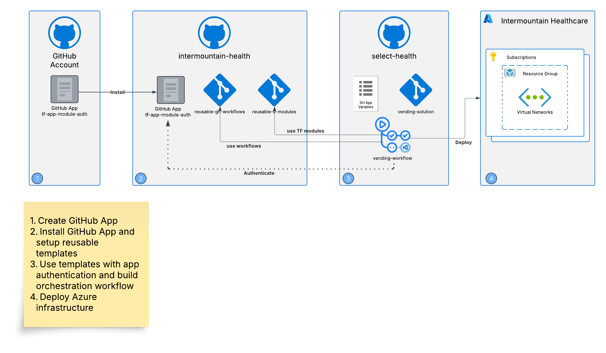
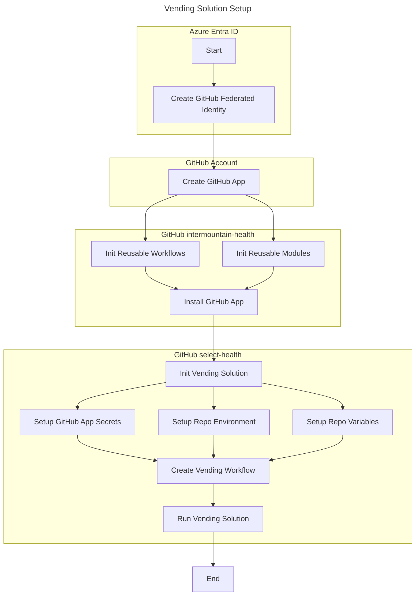
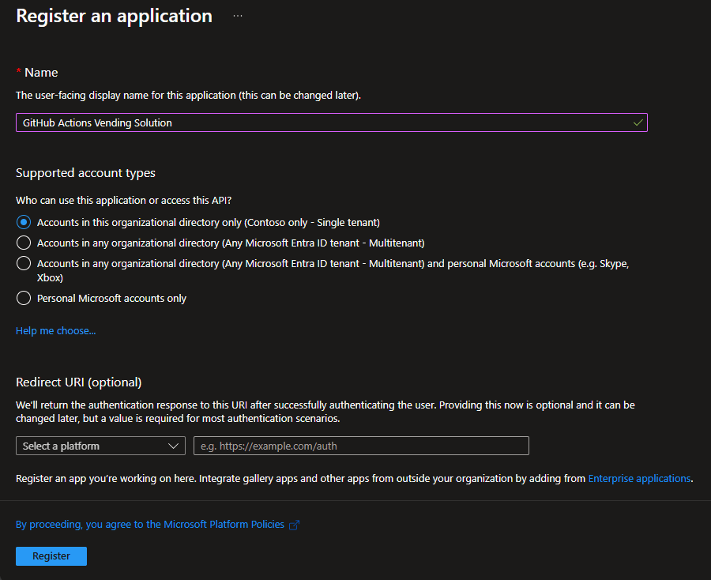

# Vending Solution

This repository includes an approach to deploy Azure Vending Solution using reusable GitHub Action workflows and Terraform modules hosted in a different GitHub organization.

## Table of Contents

1. [Requirements](#requirements)
1. [Components](#components)
1. [Setup Overview](#setup-overview)
1. [Setup](#setup)
   1. [Setup Azure Entra ID Federated Authentication](#setup-azure-entra-id-federated-authentication)
   1. [Setup GitHub Application](#setup-github-application)
   1. [Setup GitHub reusable workflows/modules](#setup-github-reusable-workflowsmodules)
   1. [Setup GitHub vending solution](#setup-github-vending-solution)
1. [GitHub reusable workflows for Terraform](#github-reusable-workflows-for-terraform)
1. [Vending Workflow](#vending-workflow)

## Requirements

1. GitHub Enterprise
1. Azure Tenant
1. Terraform backend state
   - Azure Resource Group name
   - Azure Storage Account name
   - Azure Storage Account container name

## Components

1. GitHub App - Used for cross GitHub organization authentication
1. GitHub Organization - Multiple organizations exist scoped to different purposes
1. Azure Entra ID Application - Used for Azure authentication from GitHub Actions
1. GitHub Actions - Run workflows to deploy vending solution
1. Terraform - Reusable modules to deploy Azure infrastructure
1. Azure Vending Solution **(the framework should work for other solutions having the need to source the centrally stored terraform modules)**

## Setup Overview

## Setup

1. Create Azure Entra ID application registration using [Federated Identity](https://learn.microsoft.com/en-us/entra/workload-id/workload-identity-federation-create-trust?pivots=identity-wif-apps-methods-azp) - This is used to authenticate GitHub Action with the Azure tenant.
1. Create [GitHub Application](https://docs.github.com/en/apps/creating-github-apps/registering-a-github-app/registering-a-github-app) - This is used for authentication across GitHub organizations when retrieving Terraform source.
1. In GitHub intermountain-health organization:
   - Install the GitHub application in GitHub organization with reusable modules and workflows.
   - Setup the GitHub reusable workflow and Terraform module repositories.
   - Setup the GitHub vending solution repository.
   - For the reusable workflow repository, allow other GitHub Enterprise repositories and organizations to access reusable workflows from this repository.
1. In GitHub select-health organization:
   - Setup the vending solution repository.
   - Create the GitHub repository environments.
   - Add organization level variables & secrets and limit to required repositories.
   - Add GitHub Application secrets at the organization level.
   - Verify vending solution workflow.

### GitHub Required Security

1. GitHub Application
1. Cross enterprise reusable workflows
   - Allow all actions and reusable workflows   
1. Organization level secrets
1. Repository environment level secrets
1. Vending workflow permissions
   - Read and write permissions
   - Allow GitHub Actions to create pull requests - must be enabled at the organization level first.

### Setup Azure Entra ID Federated Authentication

https://learn.microsoft.com/en-us/entra/workload-id/workload-identity-federation-create-trust?pivots=identity-wif-apps-methods-azp#github-actions

1. Create an Azure Entra ID [application registration](https://learn.microsoft.com/en-us/entra/identity-platform/quickstart-register-app?tabs=certificate) or use an Azure [user assigned managed identity](https://learn.microsoft.com/en-us/entra/identity/managed-identities-azure-resources/how-manage-user-assigned-managed-identities?pivots=identity-mi-methods-azp#create-a-user-assigned-managed-identity)

   | Display name                    | Application (client) ID -----        | Object ID                               | Directory (tenant) ID                      | tenant name               | Primary domain        | 
   |---------------------------------|--------------------------------------|-----------------------------------------|--------------------------------------------|---------------------------| --------------------- |
   | sp-ih-vendingazrescreate-prd    | 8372fd09-af5b-4e8c-9269-bcdcb4e12fbb | 4d368b35-e987-4742-9ccc-55b4cd4756f2    | a79016de-bdd0-4e47-91f4-79416ab912ad       | Intermountain Healthcare  | intermountainmail.org |
   | sp-ih-vendingsubcreate-prd      | 615ea680-5f19-4e67-9c89-ea6cafb6b613 | 466e5c27-5e52-4e96-8038-177e0e0b3b99    | a79016de-bdd0-4e47-91f4-79416ab912ad       | Intermountain Healthcare  | intermountainmail.org |

   - Copy the `Client ID` and `Tenant ID` to be used when configuring GitHub Action variables.

2. Add a federated credential for the new identity. This should represent the workload or GitHub Actions workflow that runs for the vending solution.
   - Select `GitHub actions deploying Azure resources` scenario
   - Provide the values for the following inputs.

   | Input        	| Value                                             	| Description                                                                     	|
   |--------------	|---------------------------------------------------	|---------------------------------------------------------------------------------	|
   | Organization 	| select-health                                     	| Name of the GitHub organization with the GitHub Actions workflow                	|
   | Repository   	| vending-solution                                  	| Name of the GitHub repository with the GitHub Actions workflow                  	|
   | Entity Type  	| Environment                                       	| Scope the credential to the specific environment defined in GitHub repository   	|
   | Name         	| GitHub Actions Vending Credential - {Environment} 	| Provide a unique name for the identity representing the purpose and entity type 	|

3. Assign roles to the new identity to allow it to create subscriptions:
   - Contributor - TBD

> NOTE: When using OIDC to authenticate from GitHub Actions workflow, Terraform backend provider will require `use_oidc = true`.

#### Register Azure Entra ID Application

If using an Azure Entra ID Application, set the name of the application and leave other settings as default.

### Setup GitHub Application

Use a [GitHub Application](https://docs.github.com/en/apps/creating-github-apps/registering-a-github-app/registering-a-github-app) to configure authentication to download terraform modules stored in GitHub private repositories.

   | github app name       | app id  | installed org        | org secrets/variables                                                                        |
   | --------------------- | ------- | -------------------- | -------------------------------------------------------------------------------------------- |
   | IH_TF_APP_MODULE_AUTH | 1144850 | Intermountain-Health | IH_TF_APP_MODULE_AUTH_PK, IH_TF_APP_MODULE_AUTH_APP_ID, IH_TF_APP_MODULE_AUTH_OWNER_ORG_NAME |

1. Create application under GitHub Account or Organization (<https://github.com/settings/apps>)
   1. NOTE: When using a free plan, the app must be made public to have the option to install it in other free organizations.
   2. name: tf-app-module-auth
   3. description: This app serves as authentication app (SPN) in GHE to download modules stored in GHE internal/private repo. App is required to be installed in the organization private/internal module repos are hosted. permissions must be given to the app.
   4. home page: <https://github.com/account>
   5. call back url: <https://github.com/orgname>
   6. Request user authorization (OAuth) during installation: selected
   7. Enable Device Flow: selected
1. generate private key and pem
   1. store private key in security vault service such as KV
   2. download PEM and store it in a secure service such as KV
   3. generate a secret only if required. store it in a vault service such as KV
1. capture required values
   1. App ID
   2. App private key (value from PEM)
   3. Organization name where the app was installed

### Setup GitHub reusable workflows/modules

1. Initialize the reusable GitHub workflow repository
   - Read the [documentation](.github/workflows/README.md) for the Terraform workflow.
   - Add reusable Terraform workflows:
   
   | Workflow             	|
   |----------------------	|
   | tf_apply_task.yml    	|
   | tf_inspect_task.yml  	|
   | tf_orchestration.yml 	|
   | tf_plan_task.yml     	|
   | tf_validate_task.yml 	|

1. Initialize the reusable Terraform modules repository
   - Add reusable Terraform modules
1. [Install](https://docs.github.com/en/apps/using-github-apps/installing-your-own-github-app) the GitHub application
   - (<https://github.com/apps/tf-app-module-auth/installations>)
   - Limit the scope to only the repositories required such as the reusable GitHub workflow and Terraform modules repositories.
1. [Allow](https://docs.github.com/en/enterprise-cloud@latest/repositories/managing-your-repositorys-settings-and-features/enabling-features-for-your-repository/managing-github-actions-settings-for-a-repository#allowing-access-to-components-in-a-private-repository) access to components in private repository across organization.
1. Capture the name of the GitHub organization where the GitHub application was installed.

### Setup GitHub vending solution

1. Initialize the vending solution repository
   - Add the required Terraform modules
   - Add the GitHub Actions vending solution workflows
1. Create repository environment
1. Setup GitHub Application secrets
   - Consider configuring at the organization level and specifying which repositories have access.

   | Secret             	| Value                                                                                                                                                                                           	|
   |--------------------	|-------------------------------------------------------------------------------------------------------------------------------------------------------------------------------------------------	|
   | TF_APP_PRIVATE_KEY 	| The full PEM key exported from the GitHub application.  Include all content including the text `-----BEGIN PUBLIC KEY-----` & `-----END PUBLIC KEY-----`.                                     	|
   | TF_OWNER_ORG_NAME  	| The name of the GitHub organization that has the application installed and where the reusable workflows and modules will be consumed from.  This is the scope of the authentication request. 	|
   | TF_APP_ID          	| The GitHub application identifier.                                                                                                                                                              	|

1. Setup GitHub repository environment secrets and variables

   | Secret                	| Value                                                                                                                  	|
   |-----------------------	|------------------------------------------------------------------------------------------------------------------------	|
   | AZURE_CLIENT_ID       	| The Azure Entra ID application registration identifier. This is the one used to authenticate using Federated Identity. 	|
   | AZURE_SUBSCRIPTION_ID 	| TBD                                                                                                                    	|
   | AZURE_TENANT_ID       	| The Azure tenant identifier that owns the Azure Entra ID application registration.                                     	|

1. Verify vending solution workflow
   - Requires a terraform module and GitHub Actions workflow
   - Run the workflow and confirm no errors

## GitHub reusable workflows for Terraform

see the [documentation](.github/workflows/README.md) for the Terraform workflows.

## Vending Workflow

TBD