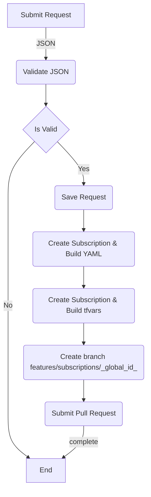
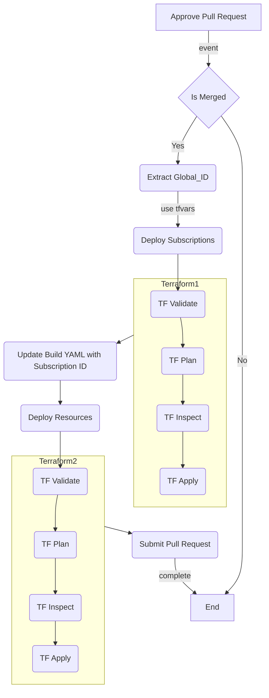

## Overview

## Table of Contents

## Workflows

- .github\workflows\vending-request-handler-workflow.yml
- .github\workflows\vending-request-processor-workflow.yml

### Vending Solution Request Processor

### Vending Solution Request Deployment

