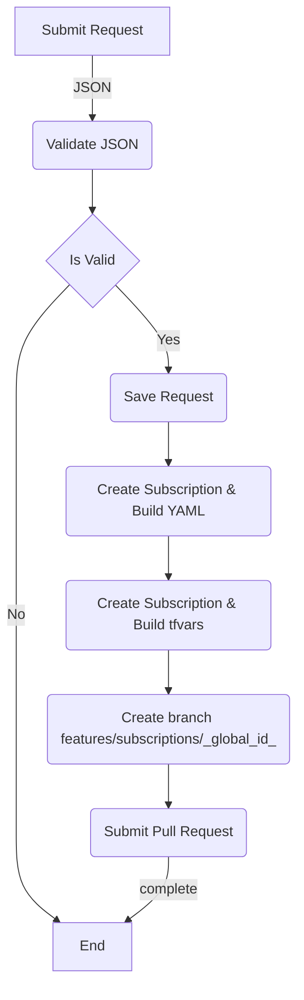
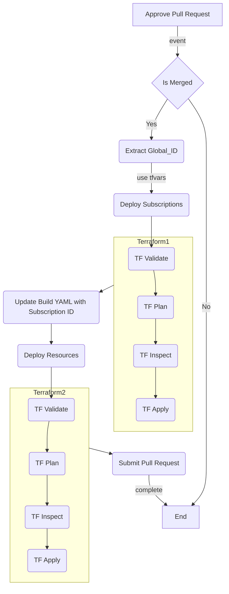

## Overview

This document outlines the GitHub Actions workflows used to process and deploy the Vending Solution. This process consists of 2 GitHub Actions workflows. The process uses a GitOps approach with configuration as code. Pull Request approvals will trigger the deployment of resources.

## Table of Contents

1. [Workflows](#workflows)
    1. [Vending Solution Request Processor](#vending-solution-request-processor)
        1. [Capabilities](#capabilities)
        1. [Inputs](#inputs-description)
        1. [Trigger](#triggering-the-workflow)
        1. [Variables](#variables)
        1. [Prerequisites](#prerequisites)
    1. [Vending Solution Request Deployment](#vending-solution-request-deployment)
        1. [Capabilities](#capabilities-1)
        1. [Inputs](#inputs-description-1)
        1. [Trigger](#triggering-the-workflow-1)
        1. [Variables](#variables-1)
        1. [Prerequisites](#prerequisites-1)

## Workflows

- [Vending Solution Request Processor](#vending-solution-request-processor) - Source is found [here](/.github/workflows/vending-request-handler-workflow.yml)
- [Vending Solution Request Deployment](#vending-solution-request-deployment) - Source is found [here](/.github/workflows/vending-request-processor-workflow.yml)

### Vending Solution Request Processor

This workflow is designed to ingest and process a JSON formatted request to initiate the vending process by validating the JSON request and generating the required Vending assets.

#### Capabilities

1. Validate JSON against schema
1. Generate Vending assets
    1. Vending YAML files
    1. Terraform variable files
1. Create GitHub Pull Request for approval

#### Triggering the Workflow

> NOTE: This requirement is not flushed out.

Currently this workflow is manually triggered and allows someone to specify the JSON as an input to the workflow. In the future, this may integrate with external processes such as Service Now.

#### Inputs Description

| Name           	| Description                                                                             	| Type   	| Default Value 	| Required 	|
|----------------	|-----------------------------------------------------------------------------------------	|--------	|---------------	|----------	|
| `request_json` 	| The vending JSON request to be processed. see [example](/examples/request-example.json) 	| string 	| n/a           	| yes      	|

#### Variables

| Name                      	| Description                                                                            	| Example                                                                                                                    	|
|---------------------------	|----------------------------------------------------------------------------------------	|----------------------------------------------------------------------------------------------------------------------------	|
| `HUB_NETWORK_RESOURCE_ID` 	| The Azure Virtual Hub resource ID to attach Azure virtual networks to.                 	| /subscriptions/{SUBSCRIPTION_ID}/resourceGroups/{RESOURCE_GROUP_NAME} /providers/Microsoft.Network/virtualHubs/MyVirtualHub 	|
| `DNS_SERVERS`             	| The comma delimited list of DNS servers to set on the Azure virtual network created.co 	| "10.0.0.1", "10.0.0.2"                                                                                                     	|

#### Prerequisites

1. **GitHub Permissions:**
    - Ensure the appropriate GitHub permissions are set in your trigger file:
        - `pull-requests: write`
        - `contents: write`
        - `actions: write`
        - `id-token: write`     

2. **Azure Authentication Setup:**
   - **GitHub Actions Environment:**
        - Create a GitHub Actions environment and define the required secrets for authenticating with Azure. This ensures that sensitive information is securely stored and managed.

   - **Federated Credentials (Recommended):**
     - Use [Federated Credentials](https://learn.microsoft.com/en-us/entra/workload-id/workload-identity-federation-create-trust?pivots=identity-wif-apps-methods-azp#configure-a-federated-identity-credential-on-an-app) for secure, passwordless authentication. With federated credentials, store the following secrets in your GitHub Actions environment:
        - `AZURE_CLIENT_ID`: The client ID of the Azure service principal.
        - `AZURE_TENANT_ID`: The tenant ID of your Azure Active Directory.
        - `AZURE_SUBSCRIPTION_ID`: The subscription ID where resources will be managed.
    - **GitHub Actions Variables:**
        - Setup required [variables](#variables).
        - Variables are currently set in the workflow file. *These should be moved to the GitHub repository environment.*

### Vending Solution Request Deployment

This workflow is designed to deploy the approved vending assets for the request in scope. This will deploy the subscriptions requested and resources.

#### Capabilities

1. Sets workflow scope given pull request details
1. Supports idempotent deployments
1. Deploys all specified subscriptions
1. Deploys all specified resources to the respective subscriptions

#### Triggering the Workflow

The workflow is triggered from the GitHub Actions pull_request event for the following conditions:
- Pull request is closed
- Pull request targets `main` branch
- Pull request includes changes to the following path `workloads/requests/**`
- Pull request is merged. *This condition only affects the workflow job, the workflow itself may trigger if this is false. This would be a case where the PR is not approved or closed and not merged.*
- A manual trigger is run using the global_id.

#### Inputs Description

| Name        	| Description                                                                                                                                                                                                  	| Type   	| Default Value 	| Required 	|
|-------------	|--------------------------------------------------------------------------------------------------------------------------------------------------------------------------------------------------------------	|--------	|---------------	|----------	|
| `global_id` 	| The unique global identifier of the application/system that maps to the specified Azure subscription and resources. This value uses the assets in the `workloads/` directory for the specific identifier. 	| string 	| n/a           	| yes      	|

#### Variables

| Name                      	| Description                     	| Example                                 	|
|---------------------------	|---------------------------------	|-----------------------------------------	|
TBD

#### Prerequisites

1. **GitHub Permissions:**
    - Ensure the appropriate GitHub permissions are set in your trigger file:
        - `security-events: write`
        - `contents: read`
        - `actions: read`
        - `id-token: write`     

2. **Azure Authentication Setup:**    
    - **GitHub Actions Environment:**
        - Create a GitHub Actions environment and define the required secrets for authenticating with Azure. This ensures that sensitive information is securely stored and managed.
    - **Federated Credentials (Recommended):**
        - Use [Federated Credentials](https://learn.microsoft.com/en-us/entra/workload-id/workload-identity-federation-create-trust?pivots=identity-wif-apps-methods-azp#configure-a-federated-identity-credential-on-an-app) for secure, passwordless authentication. With federated credentials, store the following secrets in your GitHub Actions environment:
        - `AZURE_CLIENT_ID`: The client ID of the Azure service principal.
        - `AZURE_TENANT_ID`: The tenant ID of your Azure Active Directory.
        - `AZURE_SUBSCRIPTION_ID`: The subscription ID where resources will be managed.        
3. **GitHub Setup:**
    - **GitHub Application:**
        - see [documentation](/README.md#setup-github-application)
    - **GitHub Actions Variables:**
        - Setup required [variables](#variables).
    - **Terraform Variables:**
        - Assumes the same storage account is used for the subscription and resource state.
        - `Resource Group Name` - The Azure resource group name that has the Azure Storage Account used to store Terraform state.
        - `Storage Account Name` - The Azure Storage Account name used to store Terraform state.
        - The Azure application defined in requirement [#2](#prerequisites-1) requires `Storage Blob Data Contributor` role on the storage account.

[^ table of contents ^](#table-of-contents)